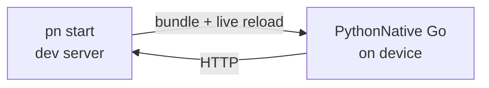

# PythonNative Go (dev server)

PythonNative Go is the fastest way to develop on a real device or
simulator. It's a prebuilt client app, the Python answer to Expo Go:
install it once, then `pn start` serves your project to it over Wi-Fi
and live-reloads on every save. There's no native rebuild in the loop,
so edit-save-see takes well under a second.

The client bakes in the `pythonnative` framework but no app code, so a
single install can run any pure-Python PythonNative project you point it
at.

## How it fits together



- `pn start` bundles your `app/` directory (plus any pure-Python
  `[requirements]`), serves it over HTTP on your LAN, and prints a URL
  and a scannable QR code.
- PythonNative Go connects to that URL, downloads the bundle into its
  on-device overlay, and mounts your app.
- When you save a file, the server rebuilds the bundle and notifies the
  device, which fetches only what changed and
  [Fast-Refreshes](hot-reload.md) in place, preserving component state.

## One-time setup: install the client

Build and install PythonNative Go on a connected device or simulator:

```bash
pn go install android
# or
pn go install ios
```

This builds a generic client (application id `com.pythonnative.go`) and
installs it. You only repeat this when you upgrade PythonNative, since
the framework is what's baked into the client. To build the artifact
without installing it (for example, to sideload by hand), use:

```bash
pn go build android
pn go build ios
```

## Daily loop: start the dev server

From your project directory (the one with `pythonnative.toml`):

```bash
pn start
```

You'll see something like:

```text
  PythonNative dev server  -  myapp
  http://192.168.1.20:8765

  <a QR code renders here>

  Open PythonNative Go on your device and scan the QR code above,
  or type the URL in by hand. Install the client with `pn go install`.
  Edit a file under app/ and the device refreshes. Ctrl+C to stop.
```

Open PythonNative Go and enter the URL (it remembers recent servers, so
the next connection is one tap). The client downloads your app and runs
it. Now edit any file under `app/`, save, and watch the device refresh.

!!! tip "Same network"
    The phone and your computer have to be on the same Wi-Fi network,
    and the network can't block client-to-client traffic (some guest or
    corporate networks do). An iOS Simulator and an Android emulator run
    on the same host, so they always work.

### Options

```bash
pn start --port 9000        # bind a different port (default 8765)
pn start --host 127.0.0.1   # bind one interface instead of all
pn start --no-qr            # print just the URL, no QR code
pn start --no-requirements  # serve app sources only, skip pip install
```

If your `pythonnative.toml` declares `[requirements].packages`,
`pn start` pip-installs them into a temporary directory and includes
them in the bundle so imports resolve on the device. Pure-Python
packages work everywhere; packages with native extensions only work in
a standalone `pn build` (Android via Chaquopy), not over the dev server.

## What's bundled

Only your sources and assets travel to the device:

- Everything under `app/` (minus caches, `__pycache__`, and compiled
  artifacts).
- Optional pure-Python dependencies, under `site-packages/`.

The framework itself is never bundled, which is exactly what lets one
prebuilt client run any project. The wire format is a small content-
addressed manifest (path, SHA-256, size) so the device only ever
downloads the bytes that actually changed.

## When to use `pn run` instead

`pn start` is the inner development loop. Use a standalone build when you
need the real thing:

- `pn run android|ios` bakes your app into the native shell and launches
  it, with no dev server involved. This is what you test before
  shipping, and the only way to exercise native extension packages on
  Android.
- `pn build android|ios` produces distributable artifacts. See
  [Building for release](building-for-release.md).

You can also iterate without a device at all using
[`pn preview`](desktop-preview.md), which renders your app in a desktop
window with the same Fast Refresh.

## Networking and security

PythonNative Go talks to the dev server over plain HTTP on your LAN, so
the client build enables cleartext traffic to local addresses:

- Android: the client manifest adds the `INTERNET` permission and
  `android:usesCleartextTraffic="true"`.
- iOS: the client `Info.plist` allows local-network HTTP via
  `NSAppTransportSecurity` and declares `NSLocalNetworkUsageDescription`.

These relaxations apply only to the PythonNative Go client, never to
your `pn build` release artifacts.

## Troubleshooting

!!! warning "The device can't reach the server"
    Confirm both devices share a network and try the URL in the phone's
    browser. If `pn start` chose an address you can't reach, pass the
    right one explicitly, for example `pn start --host 192.168.1.20`.

!!! warning "Port already in use"
    Another `pn start` may still be running. Stop it, or pick a new port
    with `pn start --port 9001`.

!!! info "SDK mismatch"
    The client warns when the framework it bundles differs from the
    `pn` CLI running the server. Rebuild the client with
    `pn go install` after upgrading PythonNative.

## Next steps

- How reloads preserve state: [Hot reload](hot-reload.md).
- The full command reference: [`pn` CLI](../api/cli.md).
- Ship a standalone build: [Building for release](building-for-release.md).
